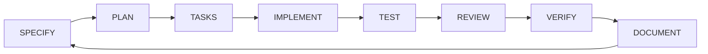

# Agent Orchestration — Graffiti Ghosts

## Purpose

This document converts the research report’s agent model into an operational workflow for Graffiti Ghosts.[DR-1]

The workflow is sequential at decision boundaries and incremental at implementation boundaries, so an unresolved upstream decision blocks downstream code rather than being silently invented.[DR-1]

## Operating sequence

| Gate | Required question | Required artifact | Exit condition |
|---|---|---|---|
| SPECIFY | What player problem, rule, state, feedback, failure, and recovery are being changed? | Feature specification | Questions answered or explicitly marked unresolved |
| PLAN | What files, modules, graph nodes, platforms, and risks are affected? | Implementation plan | Scope and dependencies accepted |
| TASKS | What small reviewable changes will be made? | Issue checklist | Each task has acceptance criteria and tests |
| IMPLEMENT | What is the smallest vertical slice that satisfies the spec? | Code, assets, tests | No platform boundary violation |
| TEST | Does behavior match the specification? | Test evidence | Focused and regression tests pass |
| REVIEW | Is the change correct, maintainable, secure, accessible, and performant? | Review record | No unresolved blocking finding |
| VERIFY | Does the integrated product work on target platforms? | Validation report | Android/Web/Wasm evidence recorded |
| DOCUMENT | Is the source of truth updated? | GDD, ADR, matrix, changelog | Traceability complete |

## Role contracts

| Agent role | Inputs | Outputs | Decision gate |
|---|---|---|---|
| Game Director | Concept, audience, constraints | Vision, pillars, scope gate | Genre, audience, platform, and MVP are explicit |
| Game Designer | Vision, references, player goals | Mechanics, progression, difficulty specs | Core gameplay stands without progression |
| Loop Engineer | Mechanics and player verbs | Loop graph, transitions, measurable hypotheses | Every edge has trigger, response, feedback, reward, failure, retry |
| Systems Designer | Mechanics and loop graph | State, entity, and system specifications | Dependencies have no cycles |
| Economy Designer | Progression and reward rules | Faucets, sinks, costs, scarcity, balancing model | No untested bottleneck or runaway inflation |
| Monetization Designer | Approved economy and platform scope | Monetization and RevenueCat spec | Monetization is explicitly approved and entitlement-based |
| Lifecycle Engineer | Platform lifecycle events | Lifecycle state machine | Background, resume, recovery, and purchase states are defined |
| UX/UI Designer | Player flows and accessibility rules | Screen and interaction spec | Critical flows work without color, audio, or reflex-only cues |
| Asset Producer | Visual/audio target and asset registry | Production-ready assets and metadata | Source, license, dimensions, format, and readability are recorded |
| Technical Architect | Approved specs and platform constraints | Architecture, dependency matrix, CI/CD | Domain/application remain platform-independent |
| Flutter/Dart Engineer | Specs, tests, assets | Dart/Flutter implementation | Native SDK dependency policy is respected |
| QA Engineer | Specs and acceptance criteria | Test matrix and evidence | Focused, regression, platform, accessibility, and performance checks pass |
| Release Manager | Verified artifacts | Release checklist and deployment | Version, signing, deployment, and rollback are documented |

## Agent message contract

Agent handoffs use a structured record with `agent_id`, `role`, `skill_id`, `input_refs`, `output_refs`, `decision_ids`, `status`, `risks`, and `acceptance_evidence`.[DR-1]

The agent record must not contain hidden design decisions; unresolved questions are explicit fields with `[UNKNOWN]`, `[ASSUMPTION]`, `[CONFLICT]`, or `[VALIDATION REQUIRED]` labels.[GG-1]

## Project-specific constraints

The source of truth is the Graffiti Ghosts GDD and its traceability matrix, not generic examples from the research report.[GG-1]

The project uses Clean Architecture and Ports & Adapters with the dependency direction `domain → application → infrastructure/platform → presentation`.[GG-1]

Shared Dart code may use official Dart and Flutter SDK APIs only, while Android and Web/Wasm capabilities are isolated behind adapters.[GG-1]

## Definition of done

A change is done only when the specification, decision log, acceptance criteria, tests, platform evidence, accessibility review, performance impact, and traceability references are updated.[GG-1]

## References

[DR-1]: ../references/deep-research-report.md "User-provided deep research report"
[GG-1]: ../../.agents/skills/graffiti-ghosts-agentic-game-development/SKILL.md "Graffiti Ghosts agentic game-development skill"
