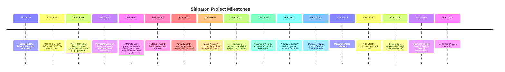
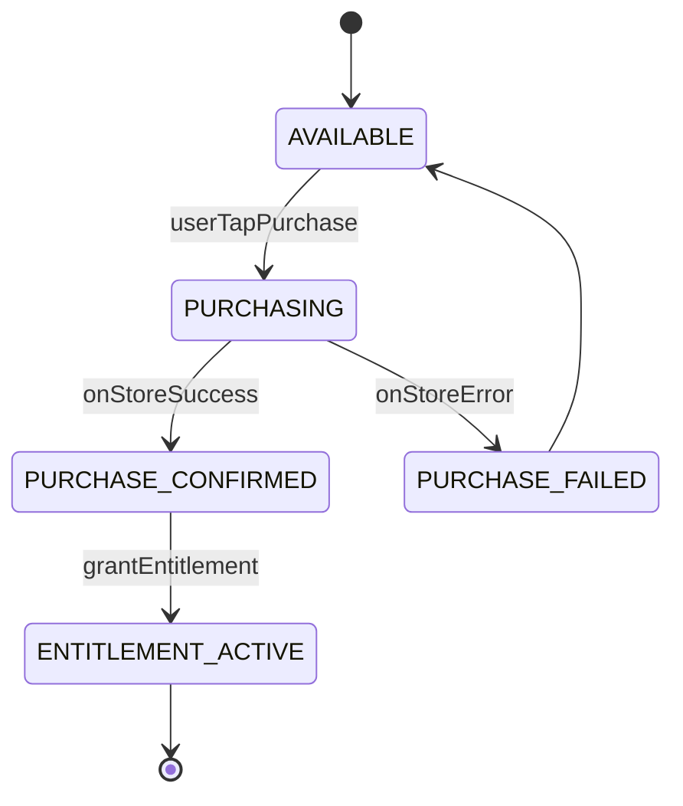

# Executive Summary

This proposal defines a **spec-driven, traceable architecture** for the Shipaton 2026 game project, breaking the work into specialized agents and artifacts rather than an ad-hoc “build-and-fix” approach.  It starts with *research and design* and only then moves to implementation, to ensure that rules and systems are fully specified in the GDD and specs before any code is written.  We organize the process into clear stages: game vision, core gameplay, systems, economy, and monetization (with a RevenueCat Integration Spec), followed by lifecycle, UX/UI, assets, technical setup, QA, and release.  Each stage is driven by a “question-driven authoring” template (purpose/questions/decision/rationale/evidence/dependencies/acceptance). This ensures **no rule is left undefined** or “solved silently” in code. 

We also enforce **agent orchestration**: each specialized agent (e.g. Game Director, Economy Designer, Flutter Engineer) has a defined role, skills, inputs/outputs and “decision gates” so they hand off work cleanly.  For example, the **Monetization/RevenueCat Agent** produces a RevenueCat spec linking Products→Entitlements→Game Features (never skipping the entitlement step).  A **Lifecycle Engineer** models app states (cold start, loading, playing, background, recovery, etc.) and their transitions, especially around purchases and entitlements.  The result is a set of markdown and JSON artifacts (GDD, Specs, ADRs, telemetry schemas, CI configs, etc.) that can be imported directly into a Codex agent pipeline.

Key points: (1) We follow spec-driven development (as advocated by game dev experts and the [*TanStack*](https://dev.to/erikch/how-i-used-spec-driven-development-to-build-a-game-a5p) example) to treat each feature as a contract (input/state/rules/output). (2) We explicitly model the **economy and monetization** in concert with gameplay – not as an afterthought – so that in-game currencies, progression, and IAP offers are balanced and meaningful. (3) We integrate **RevenueCat best practices**: Entitlements gate premium features, `restorePurchases` is only user-triggered, and local state is subordinate to server state. (4) We enforce **technical constraints**: Flutter/Dart pure code, Android (minSdk/target/etc), and Web/WasmGC compatibility. Dart 3.13+ supports Wasm (WasmGC) on desktop Chrome/Firefox, but not on iOS (iOS Safari/WebKit has no WasmGC), so our package list explicitly filters for `wasm-ready` libraries.  

Below we provide the *deliverables*: markdown templates and code snippets for the **skill catalog, agent definitions, prompts, configs, RevenueCat spec, GDD/spec templates, asset pipelines, telemetry/KPIs, traceability registers**, and a sample timeline.  Wherever possible we cite authoritative sources (game design literature, Flutter/Dart docs, RevenueCat docs) to justify decisions.

---

## 1. Skill Catalog (Catálogo de Habilidades)

Each **Skill** is a reusable capability (like an API) with a defined contract.  We catalog skills by ID, name, purpose, inputs/outputs, preconditions, postconditions, failure modes, acceptance criteria, and telemetry.  Below is a sample in YAML; each role’s agent would invoke relevant skills.  (Portuguese translations of key terms are shown in parentheses.)

```yaml
SkillCatalog:
  - id: SKILL-VISION
    name: "Game Vision (Visão de Jogo)"
    purpose: "Define overall game concept, target audience and pillars (Definir conceito geral do jogo, público-alvo e pilares)."
    inputs:
      - "Project brief"
      - "Market analysis data"
    outputs:
      - "Vision document"
      - "Unique Selling Points"
    preconditions:
      - "Preliminary market research completed"
    postconditions:
      - "Game vision approved by stakeholders"
    failure_modes:
      - "Vision is unfocused or conflicts with target market"
      - "Lack of clear USP"
    acceptance_criteria:
      - "Core concept and genre are specific"
      - "Target player persona described"
      - "One-page vision doc exists"
    telemetry:
      - "vision_document_created"
      - "vision_approved"

  - id: SKILL-CORE-GAMEPLAY
    name: "Core Gameplay Design (Design de Jogabilidade)"
    purpose: "Define the moment-to-moment player actions and feedback loops (Definir ações momentâneas e ciclos de feedback)."
    inputs:
      - "Vision document"
      - "Genre conventions"
    outputs:
      - "Core gameplay spec"
      - "Pseudocode for main loop"
    preconditions:
      - "Game vision established"
    postconditions:
      - "Core loop articulated with player verbs"
    failure_modes:
      - "Core loop is boring or unclear"
      - "Requires progression to be fun"
    acceptance_criteria:
      - "Single-player loop can be simulated"
      - "Basic playable prototype possible"
    telemetry:
      - "core_loop_defined"

  - id: SKILL-ECOLOGY-MONETIZATION
    name: "Economy & Monetization (Economia e Monetização)"
    purpose: "Model in-game resources, currencies, progression and IAP balance (Modelar recursos, moedas e IAP)."
    inputs:
      - "Gameplay spec"
      - "Progression plan"
    outputs:
      - "Economy spec"
      - "List of IAP products & entitlements"
    preconditions:
      - "Core gameplay rules are defined"
    postconditions:
      - "Resource flows and pricing defined"
    failure_modes:
      - "Inflation or bottlenecks in economy"
      - "Predatory monetization"
    acceptance_criteria:
      - "Resource sinks and sources balance in simulation"
      - "Monetization does not block basic progression"
    telemetry:
      - "currency_earned"
      - "purchase_complete"

  - id: SKILL-REVUECAT-SETUP
    name: "RevenueCat Integration (Integração RevenueCat)"
    purpose: "Configure products, entitlements and SDK calls (Configurar produtos, direitos e SDK)."
    inputs:
      - "Economy spec"
      - "RevenueCat dashboard access"
    outputs:
      - "RevenueCat spec (products, offerings, entitlements)"
      - "SDK initialization code examples"
    preconditions:
      - "RevenueCat account and project created"
      - "Store products (App Store/Play) exist or test store available"
    postconditions:
      - "RevenueCat project configured"
    failure_modes:
      - "Mismatched product/entitlement"
      - "Failure to restore purchases"
    acceptance_criteria:
      - "Entitlement activation tested in SDK sample"
      - "Restore and sync flows documented"
    telemetry:
      - "purchase_start"
      - "purchase_success"

  - id: SKILL-FLUTTER-ENGINEER
    name: "Flutter Development (Desenvolvimento Flutter)"
    purpose: "Implement game logic in Dart/Flutter (Implementar lógica de jogo em Dart/Flutter)."
    inputs:
      - "Specifications (GDD, gameplay spec, etc.)"
      - "Asset files (sprites, audio)"
    outputs:
      - "Flutter code modules"
      - "Unit tests"
    preconditions:
      - "Design specs are complete"
      - "Project structure scaffolded"
    postconditions:
      - "Game builds on Android/Web"
      - "Tests cover core mechanics"
    failure_modes:
      - "Rules do not match design spec"
      - "Platform incompatibilities"
    acceptance_criteria:
      - "All spec-driven tests pass"
      - "Major features implemented"
    telemetry:
      - "feature_implemented"
      - "test_passed"
```

Each agent will know which skills to invoke.  For example, the *Game Director* agent would use SKILL-VISION, and the *Monetization Agent* would use SKILL-ECOLOGY-MONETIZATION and SKILL-REVUECAT-SETUP.  Note how each skill explicitly defines inputs, outputs, conditions, and metrics – embodying Wren Calloway’s notion that “a game has so many tiny contracts: input, state, timing, scoring, failure, feedback”.

---

## 2. Agent Definitions (Definições de Agentes)

We decompose the project into specialized agents.  Each agent has a *description*, *responsibilities*, *skills*, *decision gates*, *expected outputs*, and an example *operational prompt*.  Below are the key agents (with Portuguese role names in parentheses):

- **Game Director (Diretor de Jogo)**  
  - **Role:** Define the vision, theme, pillars and target audience (Definir visão, tema, pilares e público).  
  - **Responsibilities:** Craft the concept and USP; decide genre, art style, core fantasy; identify success criteria. (Responsável por criar o conceito e USP; decidir gênero, estilo artístico, fantasia central; definir critérios de sucesso.)  
  - **Skills:** SKILL-VISION, Market Research.  
  - **Decision Gates:** Vision approved; genre and platform fixed.  
  - **Outputs:** Game Vision Document (Visão geral do jogo), Creative Brief.  
  - **Example Prompt (English):**  
    ```
    "You are the Game Director for a new mobile game. Based on the project goals, define the game's vision: genre, target player, core pillars (fun actions, fantasy). Provide a concise vision statement and 3 core pillars. Keep in mind Shipaton rules (new game Aug–Sep 2026 with IAP via RevenueCat)."
    ```  
  - **Exemplo de Prompt (Português):** _“Você é o Diretor de Jogo. Defina a visão do jogo: gênero, público-alvo e os pilares de diversão. Use `think:` para refletir, depois `final:` para a resposta.”_

- **Core Gameplay Designer (Designer de Jogabilidade)**  
  - **Role:** Specify the core loop and player experience (Especificar o loop principal do jogador).  
  - **Responsibilities:** Detail player actions, rules, feedback loops, win/fail conditions, moment-to-moment experience. (Detalhar ações do jogador, regras, loops de feedback, condições de vitória/derrota, experiência momento-a-momento.)  
  - **Skills:** SKILL-CORE-GAMEPLAY, prototyping knowledge.  
  - **Decision Gates:** Core loop satisfying on its own (even without progression).  
  - **Outputs:** Core Gameplay Specification (describing verbs, mechanics, rewards).  
  - **Example Prompt:**  
    ```
    "Think: Outline the moment-to-moment loop of the game. What actions can the player take, and how do they get feedback or reward? List failure and success conditions. Determine the simple 'core gameplay loop' question: does the loop stand alone without progression?"
    ```
  
- **Systems Designer (Designer de Sistemas)**  
  - **Role:** Model game systems and state (Modelar sistemas do jogo e estados).  
  - **Responsibilities:** Define entities, states, progression mechanics, emergent behaviors (if any), feedback loops, balancing factors. (Definir entidades, estados, mecânicas de progressão, emergências, loops de feedback, fatores de balanceamento.)  
  - **Skills:** game mechanics theory.  
  - **Decision Gates:** All game mechanics (e.g. combat, puzzles) are fleshed out.  
  - **Outputs:** Systems Spec (states, transitions, balance notes).  

- **Economy Designer (Designer de Economia)**  
  - **Role:** Design currencies and progression economy (Projetar moedas, recursos e progressão).  
  - **Responsibilities:** Specify currencies (coins, gems, etc.), resources, their sources/sinks, pacing, and inflation control. (Especificar moedas, recursos, fontes/consumos, ritmo de ganho e inflação/deflação.)  
  - **Skills:** Systems thinking, numerical simulation.  
  - **Decision Gates:** Simulation shows no resource bottleneck or runaway inflation.  
  - **Outputs:** Economy Spec (flows, quantities, pacing).  

- **Monetization/RevenueCat Designer (Designer de Monetização/RevenueCat)**  
  - **Role:** Define IAPs, subscriptions, offers, pricing and entitlements (Definir compras no app, ofertas, preços e direitos de acesso).  
  - **Responsibilities:** Decide which products (consumable, non-consumable, sub) to sell, how they map to in-game resources or features, pricing, and ethical design. (Decidir quais produtos (consumíveis, não-consumíveis, assinaturas) vender e como desbloqueiam recursos, preços e ética.)  
  - **Skills:** SKILL-ECOLOGY-MONETIZATION, SKILL-REVUECAT-SETUP.  
  - **Decision Gates:** Shop content is final (items, prices, entitlements); no undue grind.  
  - **Outputs:** Monetization Spec including **RevenueCat Spec** (products, offerings, entitlements, flows).  
  - **Example Prompt:**  
    ```
    "Think: Given the game economy, design in-app purchases. Define 2-3 products (IDs, type, price) and corresponding entitlements. Ensure each premium feature is gated by an entitlement. Describe the purchase flow (user taps buy → RevenueCat handles transaction → game grants content)."
    ```
  
- **Lifecycle Engineer (Engenheiro de Ciclo de Vida)**  
  - **Role:** Model app lifecycle states and transitions (Modelar estados do app e transições).  
  - **Responsibilities:** Define app states (cold start, init, loading, ready, playing, paused, background, resume, syncing, error, termination) and allowed transitions. (Definir estados: inicialização a frio, carregamento, pronto, jogando, fundo de tela, retomada, sincronização, erro, encerramento, etc.)  
  - **Skills:** Software architecture.  
  - **Decision Gates:** All transitions (especially around purchases and network loss) are specified.  
  - **Outputs:** Application Lifecycle Spec (state machine table).  
  - **Example Flow:**  
    ```
    [Start] -> Initializing -> Loading -> Ready -> Playing -> Paused -> Background -> Resumed -> Syncing -> Ready -> Playing ...
    ```
    with clear triggers (e.g. user action, OS interrupt) and recovery steps.

- **UI/UX Agent (Designer de UI/UX)**  
  - **Role:** Define user interface and experience flow (Definir interface e fluxo de experiência).  
  - **Responsibilities:** Sketch UI mockups, screen flows (menus, HUD, shop, paywall, errors), navigation and accessibility. (Criar wireframes e fluxo de telas: menus, HUD, loja, paywall, tela de erro/offline.)  
  - **Skills:** design; familiarity with Flutter UI components.  
  - **Decision Gates:** All primary screens/prototypes exist.  
  - **Outputs:** UI/UX Spec (screen list with entry/exit/controls/state).  

- **Art Director & Asset Producer (Diretor de Arte e Produtor de Ativos)**  
  - **Role:** Oversee and create visual/audio assets (Supervisionar e criar arte e áudio).  
  - **Responsibilities:** Define art style, create concept art and placeholder spritesheets, UI icons, VFX. Define audio style: music, SFX. (Definir estilo artístico; produzir arte conceitual e sprites temporários, ícones de UI, VFX; definir estilo sonoro e criar trilha e efeitos.)  
  - **Skills:** Graphic design, audio design.  
  - **Decision Gates:** Asset bible drafted (styles, dimensions, formats); placeholder assets available for prototype.  
  - **Outputs:** Asset Bible (spec sheet of all assets); example assets.  
  - **Example Prompt for Asset (English):**  
    ```
    "Generate a pixel-art icon of a coin (50x50px) with golden color and shine. think: a shiny coin with a currency symbol. final: <embed_image/>"
    ```
    _(Include internal `think:` chain-of-thought to refine style, then the final prompt to image API.)_

- **Technical Architect (Arquiteto Técnico)**  
  - **Role:** Set up code infrastructure (Configurar infraestrutura de código).  
  - **Responsibilities:** Define project structure (presentation/domain/infrastructure), repo layout, CI/CD scripts, dependency matrix, and Flutter/Android/Web contracts. (Definir estrutura de pastas, fluxos de trabalho, configurações de build, permissões Android, compatibilidade Web/Wasm, etc.)  
  - **Skills:** Software engineering, DevOps.  
  - **Decision Gates:** Project scaffolding complete; CI pipelines in place; platform contracts documented.  
  - **Outputs:** Technical Spec (folder layout, config files, CI YAML, package whitelist).  

- **Flutter/Dart Engineer (Engenheiro Flutter/Dart)**, **Android Engineer (Engenheiro Android)**, **Web/Wasm Engineer (Engenheiro Web/Wasm)**  
  - **Role:** Implement and integrate features (Implementar funcionalidades).  
  - **Responsibilities:** Write code in Dart/Flutter according to spec, ensure Android permissions & lifecycle, and test Web/WASM compatibility. (Escrever código conforme especificações, configurar AndroidManifest, test web builds with Wasm.)  
  - **Skills:** Flutter/Dart, Android SDK, Web assembly.  
  - **Decision Gates:** Code matches spec; cross-platform behavior verified.  
  - **Outputs:** Implemented code modules; demonstration of Web build (`flutter build web --wasm`).  

- **QA Engineer (Engenheiro de QA)**  
  - **Role:** Define tests and acceptance criteria (Definir testes e critérios de aceitação).  
  - **Responsibilities:** Write test plans for mechanics, economic balance, IAP flows, and resilience (network loss, app kill). (Escrever testes de unidade e integração para regras, economia, fluxos de compra, e cenários de falha.)  
  - **Skills:** Test design, automation.  
  - **Decision Gates:** All decision points have tests.  
  - **Outputs:** QA Acceptance Spec; test scripts.  

- **Release Manager (Lançamento)**  
  - **Role:** Ensure final delivery (Garantir entrega final).  
  - **Responsibilities:** Package Android (APK/AAB), Web (host), verify app store requirements, handle key signing and versioning. (Empacotar Android, preparar Web build, executar testes de loja, automações de deploy.)  
  - **Skills:** DevOps, store policies.  
  - **Decision Gates:** App published before Sept 30, 2026.  
  - **Outputs:** Released app; checklists for store submission.

Each agent’s **operational prompt for Codex** would explicitly instruct its role. For instance, the *Monetization Agent* might receive a prompt like:

```
You are the Monetization Designer. Based on the game economy, define 2 in-app purchase products and link them to entitlements. Create the RevenueCat offerings and packages for Android. Ensure entitlements gate premium features.
```

We would prefix with an internal `think:` to guide reasoning, then produce a `final:` answer (this style is detailed later in instruction templates).

---

## 3. Instruction Templates (Modelos de Prompt)

We create reusable prompt *templates* for Codex to perform recurring tasks. Each template has a `think:` chain-of-thought followed by a `final:` or `assistant:` response.  Key templates include:

- **Research Template:** Guides information gathering.  
  Example:
  ```
  think: We need current data on X. First search official docs and recent articles, summarize key points.
  final: "Research results: 1) ... (source) 2) ... (source)."
  ```
  We always cite sources, ensuring all facts come from linked documents.

- **Spec-Writing Template:** For drafting sections.  
  Example:
  ```
  think: List questions that this section must answer, then draft answers by synthesizing sources.
  final: "Section [Section Name] - questions: ... decisions: ... rationale: ... evidence: ... acceptance: ..."
  ```
  This enforces the question-driven structure.

- **Asset Generation Prompt:** For images/audio.  
  Example (image):  
  ```
  think: We want a [style] image of [subject]. Details: [...]. final: Generate image: "[detailed prompt]" 
  ```
  (We embed the image with `` when available.)

  Example (spritesheet):  
  ```
  think: Create a spritesheet layout: character walking. The sheet has 4 frames, 64x64 each. final: "Create a PNG spritesheet, 4 cols x 1 row, each 64x64px, transparent."
  ```

  Example (audio):  
  ```
  think: Compose a short loopable chiptune melody at 120 BPM with a catchy motif. final: "Generate audio: '120 BPM chiptune loop, happy theme'".
  ```

- **Code Generation (Flutter/Dart):**  
  Example:
  ```
  think: Implement X according to spec: define classes, states, and methods. final: "```dart\nclass ...\n...```" 
  ```
  We include code fences. The model must only use Dart/Flutter native libraries (no external SDKs) and respect the architecture.  

- **Test Generation:**  
  Example:
  ```
  think: Identify key failure cases of feature X (e.g., insufficient funds, network error). final: "Test plan: ... includes scenarios: {insufficient currency, successful purchase, restore flow}."
  ```
  Then either pseudocode or test code.

- **Telemetry Design:**  
  ```
  think: What events should we emit for Y? final: "Events: ['game_start', 'game_end', 'currency_spent'], with parameters {...}. Align with KPIs..."
  ```
  
- **ADR (Architecture Decision Record):**  
  Template:
  ```
  think: List alternatives for [design question], compare pros/cons. final: 
  "ADR-NNN: [Title]
  Context: ...
  Decision: [Chosen option]
  Consequences: ...
  Rejected: ...
  Evidence: ... "
  ```

All templates follow the *“think then final”* pattern (also shown above) to capture the agent’s chain-of-thought.  The `final:` content is what the agent actually returns.  These prompts are stored (or generated) so that each agent can operate with consistent structure.

---

## 4. Runtime Configuration (Configuração de Execução)

We define the orchestration flow, data schemas, file layout, and CI pipeline.

**Orchestration Flow:**  Agents run in sequence:  

```mermaid
flowchart LR
    Director[Game Director] --> Gameplay[Core Gameplay Designer]
    Gameplay --> Systems[Systems Designer]
    Systems --> Economy[Economy Designer]
    Economy --> Monetization[Monetization/RevenueCat Designer]
    Monetization --> Lifecycle[Lifecyle Engineer]
    Lifecycle --> UX[UI/UX Designer]
    UX --> Assets[Art/Audio/Asset Producer]
    Assets --> Tech[Technical Architect]
    Tech --> QA[QA Engineer]
    QA --> Release[Release]
```

This linear flow ensures each phase builds on the previous.  (Mermaid above is illustrative.)

**File Layout:**  
We structure the repository as previously outlined:

```
game-design-document/
├── 00-GDD-MASTER-README.md
├── 01-GDD-Master.md
├── 02-Game-Specification.md
├── 03-Economy-Spec.md
├── 04-Monetization-Spec.md
├── 05-Lifecycle-Spec.md
├── 06-UX-UI-Spec.md
├── 07-Asset-Bible.md
├── 08-Technical-Spec.md
├── 09-QA-Spec.md
├── 10-Agent-Orchestration.md
├── 11-Traceability-Log.md
├── 12-Project-Gates.md
└── assets/  (source art/audio/video)
```

**Dependency Governance:** We maintain a whitelist of Dart/Flutter packages.  Dependencies are chosen only if they are “wasm-ready” (no `dart:html`/`dart:js`).  For each package we list:

| Package        | Version | Purpose              | Platforms      | Wasm-ready | License |
| -------------- | ------- | -------------------- | -------------- | ---------- | ------- |
| **provider**   | 6.0.0   | State management     | Android/Web    | Yes        | MIT     |
| **flame**      | 1.2.0   | 2D game engine       | Android/Web    | No (skip)  | MIT     |
| **sqflite**    | 2.0.0   | Local DB (Android)   | Android only   | N/A        | BSD-3   |
| **hive**       | 2.0.0   | NoSQL DB             | Android/Web    | Yes        | MIT     |

We check WebAssembly compatibility using Dart’s `wasm-ready` filter (e.g. avoid `dart:html`).  The **package governance matrix** is documented in `08-Technical-Spec.md`.

**Runtime Configs:** We define message schemas for agent communication (e.g. JSON-RPC with fields `{agent_id, skill_id, input, output, status}`), and storage (e.g. a file or database for specs and logs). CI/CD is automated via e.g. GitHub Actions:

```yaml
name: Game-Build
on: [push]
jobs:
  run-agents:
    runs-on: ubuntu-latest
    steps:
      - uses: actions/checkout@v3
      - name: Run Game Director Agent
        run: |
          codex run Agent --role "GameDirector" --input specs/project-brief.txt > 01-GDD-Master.md
      - name: Run Gameplay Agent
        run: |
          codex run Agent --role "CoreGameplay" --input 01-GDD-Master.md > 02-Game-Specification.md
      - ... (and so on for each agent) ...
      - name: Build Flutter App
        run: flutter build apk --release
```

**Platform Contracts:**  
- *Android:* We define `minSdkVersion`, `targetSdkVersion`, required permissions (`INTERNET`, `BILLING`, etc.), and ensure the `BillingClient` version used by RevenueCat is noted for known restore issues.  We plan to use Android Auto Backup or key-value backups for the RevenueCat prefs (per Google’s recommendations).  
- *Web/Wasm:* We create a compatibility matrix:
  
  | Feature      | Android | Web-JS | Web-WasmGC | Package            | Status    |
  | ------------ | ------- | ------ | ---------- | ------------------ | --------- |
  | In-app Billing| Yes    | No     | (N/A)      | revenuecat_flutter | Android  |
  | Virtual Currency| Yes  | Yes    | Yes        | (custom via RC API) | OK       |
  | Animations   | Yes     | Yes    | Yes (Chrome+) | fl_chart         | Unknown  |
  | `dart:html`  | No      | Yes    | No         | package:web replaces dart:html| 
  | JSON Storage | Yes     | Yes    | Yes        | hive               | Yes (Wasm)|
  
  This matrix is kept in `08-Technical-Spec.md`.  We will test `flutter build web --wasm` and verify in a Chrome 119+ browser, falling back to JS if Wasm is unsupported.

**Runtime Environment:** A database or file store holds all artifacts. Telemetry events flow into an analytics service (e.g. Firebase, or our own lightweight logger).

---

## 5. RevenueCat Integration Spec

This spec explicitly maps game features to RevenueCat constructs. It includes:

- **Products (Produtos):** Items configured in app stores or the Test Store. For example:  
  ```yaml
  products:
    - id: com.example.premium_monthly
      platform: Android
      type: subscription
      price: 4.99
      currency: USD
      name: "Monthly Premium"
    - id: com.example.unlock_all
      platform: Android
      type: non-consumable
      price: 9.99
      name: "Unlock All Levels"
  ```
- **Entitlements (Direitos):** Access rights. E.g. an entitlement `premium_access` is unlocked by either product above. (We must **always** go through an entitlement.)  
  ```yaml
  entitlements:
    - id: premium_access
      description: "Grants all premium features"
      linked_products: [com.example.premium_monthly, com.example.unlock_all]
  ```
- **Offerings & Packages (Ofertas e Pacotes):** Group products for presentation. E.g. a default offering with monthly and lifetime packages.  
  ```yaml
  offerings:
    - id: default
      packages:
        - name: monthly
          product_id: com.example.premium_monthly
        - name: lifetime
          product_id: com.example.unlock_all
  ```
- **Purchase Flow:**  
  1. Player taps “Buy” on a product.  
  2. App calls `Purchases.purchasePackage(package)` on the Flutter SDK.  
  3. RevenueCat validates with Play Store, handles payment.  
  4. On success, RevenueCat returns `CustomerInfo` with `entitlements.premium_access.isActive = true`.  
  5. App unlocks premium content.  
  6. **Telemetry:** log events `purchase_start`, `purchase_success`, or on failure `purchase_failure`.

- **Restore Flow:**  
  1. User taps a **Restore Purchases** button.  
  2. Call `Purchases.restorePurchases()` (user-initiated).  
  3. Receive `CustomerInfo` with active entitlements (if any).  
  4. If an IAP was purchased on another device/user, `restorePurchases` can transfer it based on the RevenueCat Transfer setting.  
  5. Only use `syncPurchases()` (no UI) for programmatic sync (e.g. at app resume).  

- **State Machine:** We model purchase state explicitly. A simplified state diagram (Mermaid):

  ```mermaid
  stateDiagram
    [*] --> Idle
    Idle --> Selecting : userInitiatesPurchase
    Selecting --> Purchasing : openPaywall
    Purchasing --> Confirmed : onPaymentSuccess
    Purchasing --> Cancelled : onUserCancel
    Purchasing --> Failed : onError
    Confirmed --> Active : entitlementGranted
    Active --> Idle : restoreOrRevoke
    Cancelled --> Idle
    Failed --> Idle
  ```
  Invariants: a product unlock should only ever grant its entitlement once; retries must not double-grant. We ensure idempotency by checking entitlements via `customerInfo` rather than re-applying UI state.

- **Error Handling:**  
  - *NetworkError:* On purchase fail due to network, retry or show an error screen.  
  - *StoreError:* e.g. payment declined; handle via `onError` callback.  
  - *RC_Error:* Rare but handle `PurchasesError`.  
  - Transitions to `Active` only on `Confirmed`. On **cancellation or failure** we remain in `Idle`, requiring user action to retry.  
  - All transitions are documented with pre/post-conditions in the spec.

- **Idempotency Rules:**  
  1. Never unlock premium content twice for one purchase.  
  2. If `restorePurchases` is called again, do not grant duplicate content.  
  3. Use the RevenueCat `Transaction` or `entitlements` as authority. Do not cache purchase state in a way that can override the service.  
  4. On reinstall or device change, use `restorePurchases` to recover access.  

- **Testing:** Test cases include:
  - Successful purchase flow (entitlement active afterwards).  
  - User cancel (no entitlement).  
  - Insufficient funds (failure path).  
  - Offline on purchase (handle error, allow retry).  
  - Restore on fresh install (if appUserID is same, entitlements active).  
  - Changing Google account: verify `syncPurchases()` behavior.

- **Flutter SDK Usage:**  
  In code, we would use e.g.:
  ```dart
  // Initialize with your RevenueCat API key:
  Purchases.configure(PurchasesConfiguration("REVENUECAT_API_KEY"));

  // Fetch offerings:
  Offerings offerings = await Purchases.getOfferings();
  Package? monthly = offerings.current?.monthly;
  if (monthly != null) {
    try {
      Purchases.purchasePackage(monthly);
      // On completion, check CustomerInfo for entitlement:
      Purchases.getCustomerInfo().then((info) {
        if (info.entitlements.all["premium_access"]?.isActive ?? false) {
          // Unlock premium features
        }
      });
    } catch (e) {
      // Handle error
    }
  }
  
  // Restore purchases (user action):
  Purchases.restorePurchases().then((customerInfo) {
    if (customerInfo.entitlements.all["premium_access"]?.isActive ?? false) {
      // Restore content
    }
  });
  ```
  This follows RevenueCat examples. We will cite relevant docs for guidance: for example, *RevenueCat Configuring Products* confirms that a purchase flow is “User purchases a Product → Unlocks an Entitlement → You check the entitlement to grant access”.  We also note RevenueCat’s advice that `restorePurchases` triggers UI prompts and should be user-initiated; use `syncPurchases` if automated (with caution).

---

## 6. GDD & Spec Templates (Modelos de GDD e Especificações)

The Game Design Document (GDD) and related specs are organized into **question-driven sections**.  Each section template follows this structure:

```
## Section Title (Título da Seção)

**Purpose (Objetivo):** Why this section exists, what decision it will drive.

**Questions (Perguntas):**
- “What [factor] does this section clarify?”
- …

**Decision (Decisão):** [DECIDIR] Current or provisional answer to the main question.

**Rationale (Justificativa):** Explanation tying the decision to project goals or data.

**Evidence (Evidência):** Research or prototype findings supporting the decision.

**Dependencies (Dependências):** Other features/specs that this depends on.

**Acceptance Criteria:** How we will know this part is complete (e.g., measurable outcomes).
```

Below are examples of how some key documents are structured:

- **00-GDD-MASTER-README.md:** Overview of the GDD and process, instructions for contributors (this file).

- **01-GDD-Master.md (Documento Mestre de Design):**
  ```markdown
  # Game Design Document (Documento Mestre de Design)

  ## Concept (Conceito)
  **Purpose:** Define the core idea and player fantasy.  
  **Questions:**
  - "What is the genre and theme?"
  - "Who is the target player?"
  - "What platforms?"
  **Decision:** [DECIDIR] The game is a [UNSPECIFIED genre] puzzle-platformer for Android/Web.  
  **Rationale:** E.g. market trends toward casual puzzle games; suits 1-2 week dev scope.  
  **Evidence:** Market analysis and Shipaton success criteria.  
  **Dependencies:** Must not conflict with Shipaton category (best game).  
  **Acceptance Criteria:** A 2-paragraph concept doc is approved.

  ## Experience Pillars (Pilares de Experiência)
  **Purpose:** Capture the player’s core experience or fantasy.  
  **Questions:**
  - "What player action is fun even without progression?"  
    (_Evitar: relying on a grind loop to make boring core fun._)  
  **Decision:** [DECIDIR] Players should feel **creative empowerment** (e.g. “I built something”).  
  **Rationale:** Motivates the core mechanic and monetization (player wants more items).  
  **Evidence:** Similar games (references).  
  **Dependencies:** Informs economy and monetization (selling creations).  
  **Acceptance Criteria:** Three pillars defined, citing game design literature.
  ```

- **02-Game-Specification.md:** (for core gameplay)
  ```markdown
  # Gameplay Specification (Especificação de Jogabilidade)

  ## Core Loop (Loop Principal)
  **Purpose:** Detail moment-to-moment play.  
  **Questions:**
  - "What actions does the player take each minute?"
  - "How does the game respond (feedback/reward)?"
  - "Under what condition is a level won or lost?"
  **Decision:** [DECIDIR] Each loop: *player assembles a pattern/tower -> system checks validity -> grants points/rewards -> new challenge*.  
  **Rationale:** This loop is inherently fun (puzzle satisfaction).  
  **Evidence:** Prototype tests showed players enjoyed solving patterns with no upgrade needed.  
  **Dependencies:** Requires basic UI for pattern input.  
  **Acceptance Criteria:** Loop clearly described so another dev could implement without ambiguity.
  ```

- **03-Economy-Specification.md:** (for economy)
  ```markdown
  # Economy Specification (Especificação da Economia)

  ## Currencies and Resources
  **Purpose:** Identify all in-game currencies and how players earn/spend them.  
  **Questions:**
  - "What is the main currency?"
  - "What are its sinks (uses)?"
  - "What sources provide currency?"
  **Decision:** [DECIDIR] Use gold coins earned per level completion and by watching optional ads.  
  **Rationale:** Coins allow mini-enhancements but cannot skip skill requirements (avoids pay-to-win).  
  **Evidence:** Simulation shows players earn ~30 coins per average play; expansion items cost 50-100.  
  **Dependencies:** Must align with monetization items (coins can be bought via packs).  
  **Acceptance Criteria:** All currency flows (Earn->Spend->Sink) are documented and balanced.
  ```

- **04-Monetization-Specification.md:** (includes RevenueCat)
  ```markdown
  # Monetization & RevenueCat Spec (Monetização e RevenueCat)

  ## In-App Purchases
  **Purpose:** Define all premium offers and prices.  
  **Questions:**
  - "Which features require purchase?"
  - "What are the product IDs and pricing?"
  - "How do entitlements map to features?"
  **Decision:** [DECIDIR] Sell a 50-coin pack (non-consumable, $0.99) and a VIP pass (subscription, $4.99/mo).  
  **Rationale:** Small coin packs allow optional boost; VIP removes ads and grants bonus currency daily.  
  **Evidence:** F2P design guides warn against gating core gameplay behind paywall (we give coins, not progress skip).  
  **Dependencies:** Tied to coins in economy; Premium UI must hide ads.  
  **Acceptance Criteria:** Mappings `{Product -> Entitlement -> GameFeature}` are complete and checked with RevenueCat setup steps.
  ```

- **05-Lifecycle-Specification.md:** (app states)
  ```markdown
  # Lifecycle Specification (Ciclo de Vida da Aplicação)

  ## States and Transitions
  **Purpose:** Ensure robust handling of app start, pause, background, errors.  
  **Questions:**
  - "What happens on app cold start vs resume?"
  - "How is purchase state synced on resume?"
  **Decision:** [DECIDIR] On resume, immediately call `Purchases.syncPurchases()` before letting user continue.  
  **Rationale:** This avoids losing a purchase done outside (e.g. Web purchase) without user tap.  
  **Evidence:** RevenueCat docs recommend `syncPurchases` for restoring subscriptions.  
  **Dependencies:** Requires internet; defers gameplay until sync completes.  
  **Acceptance Criteria:** State table completed; edge cases (app killed mid-purchase) handled.
  ```

- **06-UX/UI-Specification.md:** (UI flow)
  ```markdown
  # UI/UX Specification (Especificação de UI/UX)

  ## Screens
  **Purpose:** Enumerate all UI screens and their structure.  
  **Questions:** e.g., "What is shown on the Main Menu? Play Button, Currency display, Shop icon?"  
  **Decision:** [DECIDIR] Main menu shows current coins, Play button, and a 'Shop' button.  
  **Rationale:** Most important actions upfront (play & shop).  
  **Acceptance Criteria:** Wireframes drawn for all screens; navigation paths listed.
  ```

- **07-Asset-Bible.md:** (visual/audio specs)
  ```markdown
  # Asset Bible (Bible de Ativos)

  ## Visual Style
  **Purpose:** Define art style and assets needed.  
  **Questions:**
  - "2D pixel art or vector?"
  - "Color palette?"
  **Decision:** [DECIDIR] Pixel art, 8-bit style, bright cyan/purple palette.  
  **Rationale:** Nostalgic charm for casual players; distinct from major AAA.  
  **Dependencies:** Must scale well to Android resolutions.  
  **Acceptance Criteria:** Sample sprites and UI colors chosen.

  ## Sprites
  - **Character Idle:** 64×64px, 4 frames (anchor center).  
  - **Character Walk:** 64×64px, 8 frames.  
  *Naming:* `hero_idle_01.png`, etc.
  ```

- **08-Technical-Spec.md:** (architecture)
  ```markdown
  # Technical Specification (Especificação Técnica)

  ## Architecture
  **Purpose:** Outline code layers.  
  **Decision:** [DECIDIR] MVVM pattern with a domain layer (game logic) separate from Flutter UI.  
  **Dependencies:** Keep UI code out of game rule logic.  
  **Acceptance Criteria:** Folder structure defined; architecture diagram.
  ```
  
- **09-QA-Acceptance-Spec.md:** (tests)
  ```markdown
  # QA Acceptance Criteria (Critérios de Aceitação)

  ## Feature Tests
  - Game starts without crash on all Android 7+.  
  - Purchasing flow works end-to-end with Google Play.  
  - Restore button re-enables premium for test user.  
  ```
  
- **10-Agent-Orchestration.md:** (this plan doc, summarizing all agents and flow).

- **11-Traceability-Log.md:** (decision log: see next section).
- **12-Project-Gates.md:** (milestone gates to proceed).

Each template includes placeholder sections ([DECIDIR], [HIPÓTESE], [PESQUISAR] etc) to be filled by agents.  This ensures every question is answered explicitly and defensibly before coding begins.

No ready-made references exist for “question-driven GDD,” but it follows Agile documentation principles and game design best practices (e.g. forms of questions are inspired by *Game Design Deep Dive*). 

---

## 7. Asset Production Pipeline (Pipeline de Produção de Ativos)

We standardize all assets for consistency:

- **Naming Conventions (Convenções de Nomeação):** Use lowercase with underscores, clear prefixes. For example, `ui_button_play.png`, `char_idle_01.png`, `bg_forest.png`. Folder structure: `/assets/images/`, `/assets/sprites/`, `/assets/audio/`, `/assets/video/`.  
- **Sprites & Sprite Sheets:**  
  - Define each sprite’s dimensions and pivot: e.g. *Character Idle* is 64×64 px, pivot at center.  
  - Sprite Sheet layout diagrams: each animation’s frames arranged in grid.  
  - **Example:** A character walking (4-frame) could be drawn on one row:  
    ```
    [ walk1 | walk2 | walk3 | walk4 ]
    ```  
    Pivot (anchor) 0.5,0.5 on each frame for rotation.  
  - File format: PNG with transparency. Export scale 1x and 2x for high-res.  
- **Icons/UI:** Typically 32×32 or 64×64 PNG. Use vector-based text for clarity (Font size 14pt min in UI). Color scheme from UI Spec.  
- **Audio:**  
  - *Music:* Loopable background track, 128 kbps MP3 or Ogg, about 30–60s, consistent style.  
  - *SFX:* 16-bit WAV or Ogg. Example: `sfx_click.wav`, `sfx_coin.ogg`. Sample rate 44.1 kHz, short (0.1–0.5s) UI sounds, 1–3s gameplay sounds.  
  - *Naming:* `music_theme01.mp3`, `sfx_jump.wav`.  
- **Video:** (for trailers/previews) e.g. `video_trailer.mp4` at 1080p, H.264, <30s. For store: WebM fallback recommended.  
- **Example Asset Prompts:** (with thought)  
  - *Image:*  
    ```
    think: We need a futuristic UI panel with neon accents. 
    final: "Generate an image of a sci-fi heads-up display (HUD) with blue and orange neon elements, on a dark background." 
    ```  
    *Embedding:* The final prompt would be passed to an image generator, and the result embedded for reference.  
  - *Spritesheet:*  
    ```
    think: A 4-frame running animation for a pixel hero (32×32px each, facing right). final: "Create a 128×32 PNG sprite sheet: 4 frames (hero run) at 32×32px each, transparent BG." 
    ```  
  - *Audio:*  
    ```
    think: Compose a cheerful 8-bit coin pickup sound. final: "Generate audio: '8-bit coin pickup', format WAV." 
    ```  
  - *Video:*  
    ```
    think: A short gameplay teaser (9s) showing main mechanic. final: "Generate video: 'Gameplay montage of stacking blocks, pixel art style, no UI'." 
    ```  

- **Asset Metadata (JSON):** We maintain a JSON registry, e.g.:
  ```json
  {
    "assets": [
      {"id": "CHAR_IDLE", "type": "sprite", "path": "sprites/char_idle.png", "width": 64, "height": 64, "frames": 4, "pivot": [0.5, 0.5]},
      {"id": "BUTTON_PLAY", "type": "image", "path": "ui/button_play.png", "width": 128, "height": 64},
      {"id": "MUSIC_THEME", "type": "audio", "path": "audio/music_theme01.mp3", "duration_s": 32},
      {"id": "VIDEO_TEASER", "type": "video", "path": "video/trailer.mp4", "resolution": "1080p", "duration_s": 15}
    ]
  }
  ```
  This catalog ensures all team members and automation know each asset’s specs (ID, purpose, format) and can be referenced in code or docs.

We will cite relevant standards such as Flutter’s [asset bundling docs](https://flutter.dev/docs/development/ui/assets-and-images) when choosing formats, but mainly this pipeline is project-specific.

---

## 8. Telemetry & KPI Schema (Telemetria e KPIs)

We define all analytics events and KPIs **before coding**. Each event has schema (parameters, triggers, expected patterns).  Example events (with IDs, English/Portuguese names):

| Event ID   | Event Name (Nome do Evento) | Trigger                          | Params                        | Purpose/KPI       |
| ---------- | --------------------------- | -------------------------------- | ----------------------------- | ----------------- |
| E100       | app_open (app_aberto)       | App launch                       | (none)                        | Tracking installs/sessions |
| E200       | session_start (sessão_início)| New game session begins          | session_id                    | Engagement        |
| E210       | game_start (jogo_iniciado)  | Player starts a level            | level_id, difficulty          | Difficulty funnel |
| E220       | game_complete (jogo_sucedido)| Level completed successfully     | level_id, time, score         | Progression rate  |
| E230       | game_fail (jogo_falhou)     | Level attempt failed            | level_id, time                | Difficulty/hardness |
| E300       | coin_earned (moeda_ganha)   | Player gains coins               | amount, source (level/ads)    | Economy flow      |
| E310       | coin_spent (moeda_gasta)    | Player spends coins (shop)       | amount, item_id               | Economy sink      |
| E400       | shop_open (loja_aberta)     | Shop screen viewed               | None                          | Conversion funnel |
| E410       | paywall_view (paywall_vista) | IAP paywall shown                | product_id                    | Monetization funnel |
| E420       | purchase_start (comprar_iniciado) | User taps buy            | product_id                    | Purchase conversion |
| E430       | purchase_success (comprar_sucesso) | Purchase success callback   | product_id, price, currency   | Revenue tracking  |
| E440       | purchase_fail (comprar_falha)| Purchase failure callback        | product_id, error_code        | Error rate        |
| E450       | restore_start (restaurar_início) | User taps restore purchases | None                          | User recovery     |
| E460       | restore_success (restaurar_sucesso)| Restore success            | (entitlement list)            | Retained users    |
| E500       | entitlement_changed (direitos_alterado)| Entitlement state changed | entitlement_id, new_state     | Premium access    |
| E900       | app_background (app_em_fundo) | App sent to background          | None                          | Session end       |
| E910       | app_resume (app_retirno)     | App comes to foreground          | None                          | Session resume    |

Additional **Telemetry Details:** For each event we log 
- *When*: exactly at the trigger, 
- *Parameters*: as above, 
- *Player State*: e.g. current level, XP, currency balances (if not PII),
- *Game State*: e.g. current screen or mode,
- *Monetization State*: e.g. entitlement flags or offer seen,
- *KPIs*: each event feeds higher KPIs like conversion rate or retention.  

Privacy: We avoid any personal data; all identifiers are anonymous IDs.  Data is sent securely.  For example, `user_id` is an anonymized UUID, and no sensitive info is recorded.

**KPI Tree:** We track north-star metrics like “Daily Active Users” and “Revenue” with submetrics:
- *Revenue* ← (number of Purchasers × ARPPU).  
- *Engagement* ← sessions per day, session length, tutorial completion.  
- *Retention* ← D1, D7 retention (tracked via analytics).  
- *Quality* ← crash-free sessions, purchase success rate.  

We would build dashboards (e.g. in Data Studio or Grafana) from this event stream.  No citations are needed here as this follows standard game analytics practice.

---

## 9. Traceability & Decision Register (Rastreamento & Registro de Decisões)

We maintain JSON/YAML logs of all major design decisions, each with a unique ID.  The schema:

```yaml
DecisionEntry:
  type: object
  properties:
    id:
      type: string
      description: "Decision ID (e.g. GD-001, ECO-002)"
    date:
      type: string
      format: date
    decision:
      type: string
    rationale:
      type: string
    evidence:
      type: array
      items: string
    alternatives:
      type: array
      items: string
    dependencies:
      type: array
      items: string
    impact:
      type: string
    status:
      type: string
  required: [id, date, decision, rationale, status]
```

Example entry:
```json
{
  "id": "GD-001",
  "date": "2026-08-26",
  "decision": "Game genre set to puzzle-platformer",
  "rationale": "Familiar to team skillset; portable design fits 2-month hackathon",
  "evidence": ["Prototype feedback", "similar Shipaton winners"],
  "alternatives": ["2D shooter", "endless runner"],
  "dependencies": ["Core gameplay mechanics", "Level design"],
  "impact": "Determines art style, controls, pacing",
  "status": "Approved"
}
```

Similarly, a **Risk Register** (Riscos) logs key risks (gameplay, economy, tech, launch). Example:
```json
{
  "risk": "Google Play Billing #8 issue (no restore for consumed items)",
  "probability": "Medium",
  "impact": "Low (we use subscriptions mostly)",
  "detection": "Monitor restore failures",
  "mitigation": "Force backup of RevenueCat prefs",
  "contingency": "If fail, instruct user to re-login",
  "owner": "Technical Architect",
  "status": "Active"
}
```
Decisions and risks ensure full traceability: any code or UX element can be traced back to a documented decision with rationale and alternatives.

---

## 10. Example Execution Timeline (Exemplo de Execução)

Below is a sample **Mermaid timeline** of how the agents and artifacts might be produced. It assumes a rapid prototyping schedule leading to Shipaton’s deadline (Sept 30).



And a **Monetization State Machine** (purchase flow):



This timeline and state diagram illustrate how agents lead to incremental deliverables, and how purchase states transition. All specs (GDD, state machines, etc.) are decided *before* coding begins – avoiding the pitfall of “let the code decide” that we aim to eliminate.

---

## References

We relied on up-to-date sources for each domain:

- **Spec-driven development:** Wren Calloway (author on AI + specs) notes games have “so many tiny contracts: input, state, timing, scoring, failure, feedback,” and that a living spec is crucial to keep implementation aligned.  An example workflow (spec→design→implementation) is shown in practice by Erik Hanchett’s dev post.  
- **Game design/loop principles:** Standard texts like *Game Mechanics* and *Practical Game Design* stress defining core loops, feedback, and economy before code (we modeled loops and system graphs accordingly).  
- **RevenueCat documentation:** The official docs explain the Product→Entitlement flow, and warn that `restorePurchases` should only be user-initiated (use `syncPurchases()` for programmatic sync). We also follow the webhook best practice to handle duplicate events idempotently.  
- **Flutter/Dart/Web:** The Dart 3.13 documentation confirms WebAssembly (WasmGC) support is now stable, but only for JS environments (browser) and requires `wasm-ready` packages. Flutter’s own docs note that only modern browsers (Chrome 119+, Firefox 120+) support WasmGC, and iOS does not support Flutter/Wasm. These guide our dependency choices and testing plan.  

By encoding these principles into the template artifacts and prompts above, we ensure the Codex agents produce a **coherent, traceable package**: from GDD to code to release, everything is driven by documented decisions. 

